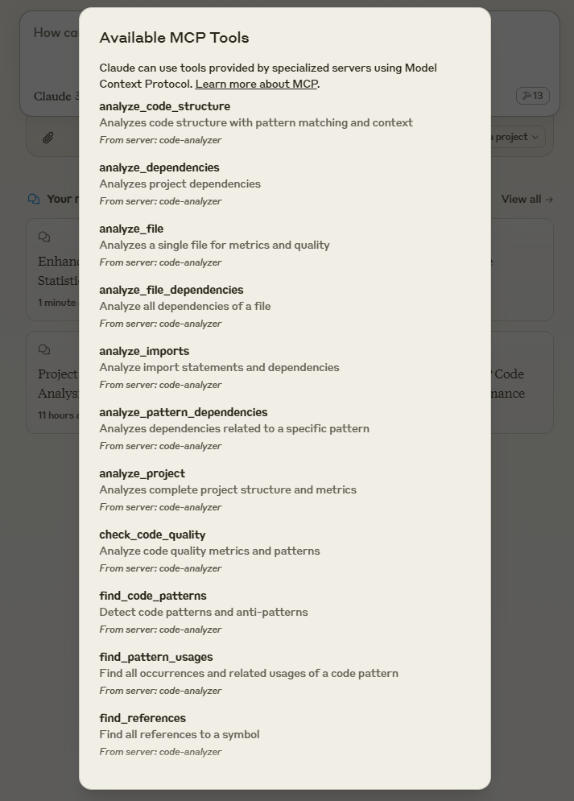
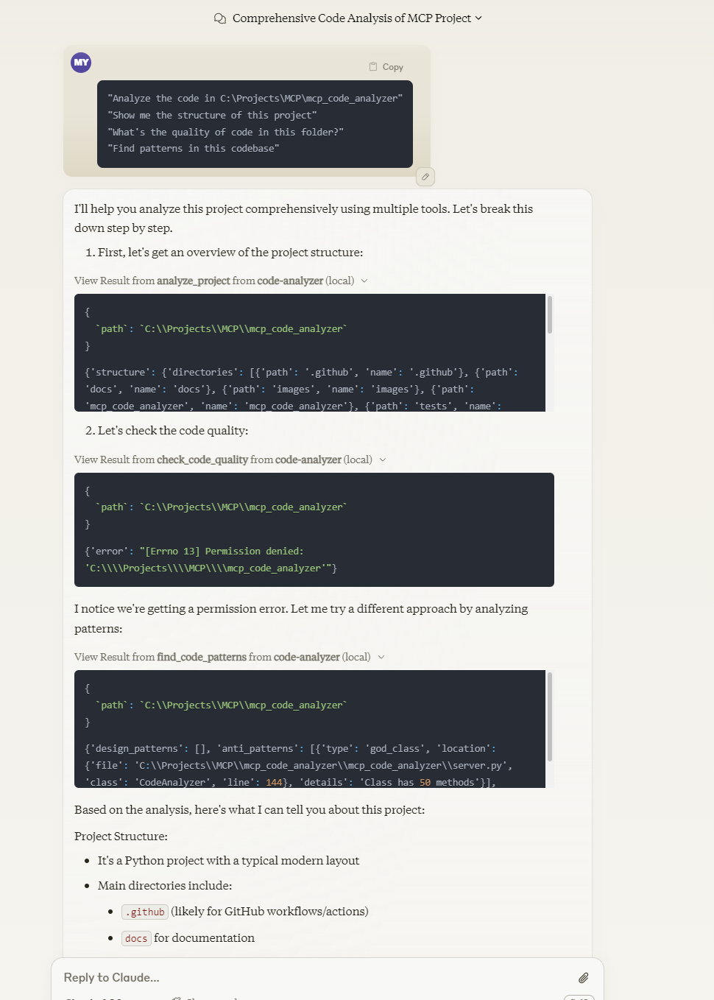
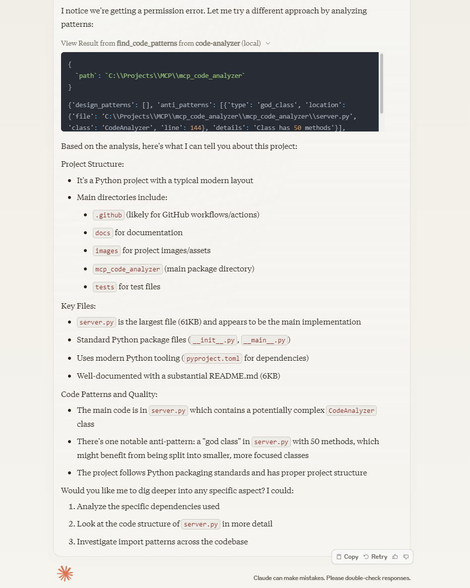

# MCP Code Analyzer

## Overview
A Model Context Protocol (MCP) server implementation for comprehensive code analysis. This tool integrates with Claude Desktop to provide code analysis capabilities through natural language interactions.

## 🚧 Project Status

### Working Features
- **analyze_project**: Project structure and basic analysis
- **analyze_structure**: Directory and file organization analysis

### Needs Testing (Expected to Work)
- analyze_file
- analyze_pattern_dependencies
- suggest_refactoring
- preview_changes
- find_references
- analyze_code_structure
- analyze_imports
- analyze_file_dependencies
- find_pattern_usages
- analyze_dependencies
- check_code_quality
- find_code_patterns

### Known Issues
⚠️ **Path Resolution Inconsistencies:**
- Intermittent issues between chat and config paths
- Workaround: Try both methods if one fails

## Prerequisites
- Python 3.10 or later
- Windows/Linux/MacOS
[README.md](README.md)
## Installation

### Local Installation
```bash
# Clone the repository
git clone https://github.com/[your-username]/mcp-code-analyzer.git
cd mcp-code-analyzer

# Install dependencies and package
pip install -e .
```

## Claude Desktop Integration

### Configuration Setup
1. Access Claude Desktop config:
   ```
   Win + R → %AppData%\Claude\
   ```
2. Create/edit `claude_desktop_config.json`:
   ```json
   {
     "globalShortcut": "Ctrl+Space",
     "mcpServers": {
       "code-analyzer": {
         "command": "python",
         "args": [
           "-c",
           "import sys; sys.argv = ['', '--path', 'C:\\Projects\\YourProject\\src']; from mcp_code_analyzer import main; main()"
         ]
       }
     }
   }
   ```

## Detailed Tool Documentation

### Working Tools

1. `analyze_project`
   - ✅ Tested and Working
   - **Purpose**: Complete project structure and code analysis
   - **Input**: Optional project path
   - **Returns**: Comprehensive analysis results including:
     - Project structure
     - File organization
     - Basic metrics

2. `analyze_structure`
   - ✅ Tested and Working
   - **Purpose**: Directory and file organization analysis
   - **Input**: Project path
   - **Returns**: Detailed structure analysis including:
     - Directory hierarchy
     - File distribution
     - File types
     - Size statistics

### Tools Needing Testing

3. `analyze_file`
   - **Purpose**: Detailed single file analysis
   - **Returns**: 
     - Code metrics
     - Complexity measures
     - Quality indicators

4. `analyze_pattern_dependencies`
   - **Purpose**: Pattern dependency analysis
   - **Returns**: 
     - Direct dependencies
     - Indirect dependencies
     - Usage patterns

5. `suggest_refactoring`
   - **Purpose**: Refactoring suggestions
   - **Returns**: 
     - Code changes
     - Impact analysis
     - Risk assessment

6. `preview_changes`
   - **Purpose**: Preview refactoring impact
   - **Returns**: 
     - Modified files
     - Before/after comparisons
     - Potential risks

7. `find_references`
   - **Purpose**: Find all code references
   - **Returns**: 
     - File locations
     - Usage context
     - Reference types

8. `analyze_code_structure`
   - **Purpose**: Code structure analysis
   - **Returns**: 
     - Code organization
     - Component relationships
     - Architecture patterns

9. `analyze_imports`
   - **Purpose**: Import statement analysis
   - **Returns**: 
     - Import patterns
     - Dependency chains
     - Unused imports

10. `analyze_file_dependencies`
    - **Purpose**: Single file dependency analysis
    - **Returns**: 
      - Module dependencies
      - Class dependencies
      - Function dependencies

11. `find_pattern_usages`
    - **Purpose**: Find pattern occurrences
    - **Returns**: 
      - Locations
      - Usage context
      - Frequency analysis

12. `analyze_dependencies`
    - **Purpose**: Project-wide dependency analysis
    - **Returns**: 
      - Dependency graph
      - Circular dependencies
      - Module relationships

13. `check_code_quality`
    - **Purpose**: Code quality assessment
    - **Returns**: 
      - Code complexity
      - Maintainability index
      - Code smells

14. `find_code_patterns`
    - **Purpose**: Detect code patterns
    - **Returns**: 
      - Common patterns
      - Anti-patterns
      - Design patterns

## Usage in Claude Chat

The analyzer automatically responds to natural language queries in the Claude chat. Simply describe what you want to analyze, and the appropriate tool will be invoked.

Example queries:
```
"Analyze the code in C:\Projects\MyProject"
"Show me the structure of this project"
"What's the quality of code in this folder?"
"Find patterns in this codebase"
```

## Troubleshooting

### Log Access
1. Open log directory:
   ```
   Win + R → %AppData%\Claude\logs
   ```
2. Check recent log files for errors

### Common Issues
1. **Path Not Found**
   - Verify path exists
   - Check path format in config
   - Try both relative and absolute paths

2. **Import Errors**
   - Confirm Python 3.10+ installation
   - Verify package installation
   - Check dependency installations

3. **Connection Issues**
   - Restart Claude Desktop
   - Check server process
   - Verify config syntax

4. **Path Resolution**
   - Try both config and chat paths
   - Use forward slashes in chat
   - Use double backslashes in config

## Contributing

### Priority Areas
1. Tool Testing
   - Validate untested features
   - Add integration tests
   - Create test documentation

2. Documentation
   - Usage examples
   - API documentation
   - Configuration guides

3. Performance
   - Optimization opportunities
   - Memory usage improvements
   - Response time enhancements

### How to Contribute
1. Fork the repository
2. Create a feature branch
3. Install development dependencies:
   ```bash
   pip install -e .
   ```
4. Test thoroughly
5. Submit pull request

## Usage Examples



  
## License
This project is licensed under the MIT License - see the [LICENSE](LICENSE) file for details.
 